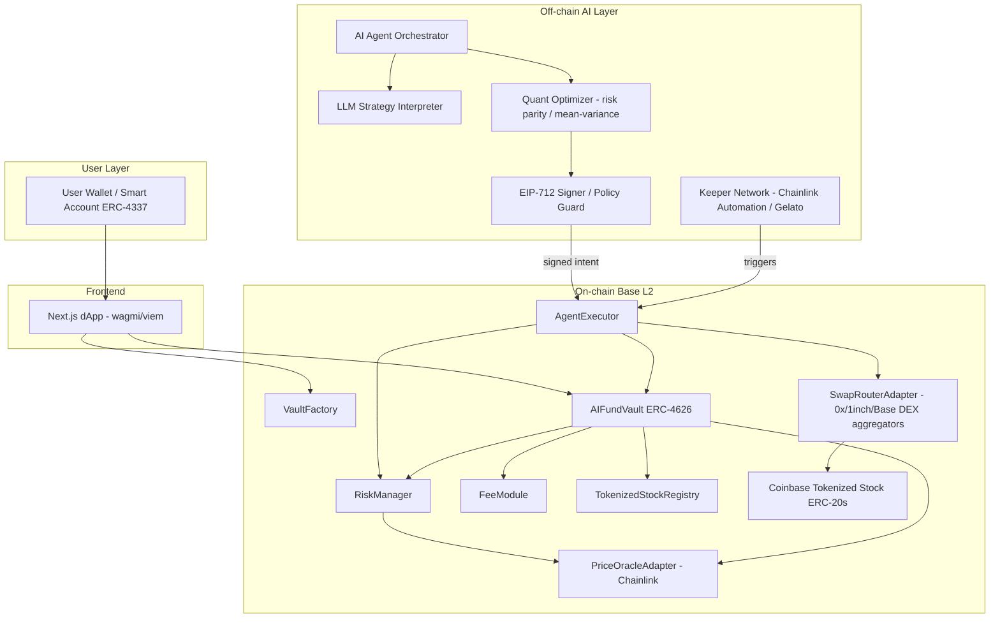

# AutoVault (AgentFund / SmartIndex AI)
### Autonomous AI Investment Fund on Base — Full Technical & Product Specification

---

## 1. Executive Product Summary

AutoVault is a non-custodial, on-chain protocol on **Base** that lets any user deposit USDC (or ETH) into an
AI-managed fund that exclusively holds **Coinbase-issued tokenized stocks**. Depositors receive an ERC-4626
share token representing a proportional claim on the fund's net asset value (NAV). An off-chain AI agent
(hybrid LLM + quantitative optimizer) proposes portfolio allocations and rebalances; on-chain smart contracts
enforce hard risk limits and execute only signed, verifiable instructions. The protocol targets both
crypto-native users seeking composable equity exposure and emerging-market users seeking simplified access to
U.S. equities.

Key properties:
- **Non-custodial**: users can always redeem shares for their pro-rata share of underlying assets.
- **Constrained autonomy**: the AI agent proposes, the contracts constrain — no single actor can move funds
  outside pre-approved parameters.
- **Composable**: share tokens are standard ERC-4626/ERC-20, usable elsewhere in Base DeFi.
- **Transparent**: every allocation decision, trade, and NAV update is logged on-chain with human-readable
  rationale stored off-chain (IPFS) and hash-anchored on-chain.
- **Multi-vault**: the protocol is a factory of independent, isolated vaults (different strategies/risk
  profiles), not a single monolithic fund.

This is a specification for engineering purposes only. It is not investment advice, and nothing here should be
construed as an offer of securities.

---

## 2. System Architecture

### 2.1 Component overview



### 2.2 Trust boundaries

1. **User → Vault**: trustless. Deposit/withdraw logic is deterministic ERC-4626 math; user never needs to
   trust the agent to exit.
2. **Agent → AgentExecutor**: the agent's off-chain output is a signed intent (EIP-712 struct: target vault,
   trade list, max slippage, expiry, nonce). `AgentExecutor` verifies the signature against a registered
   `agentSigner` address per vault (rotatable by governance/timelock) and re-validates every trade against
   `RiskManager` limits before execution — the agent cannot bypass on-chain constraints even with a valid
   signature.
3. **Governance → Protocol**: a timelocked multisig (Safe) controls: adding tokenized stocks to the registry,
   changing risk parameters within bounded ranges, changing fee rates within bounded ranges, pausing, and
   rotating the agent signer. Governance cannot withdraw user funds or bypass ERC-4626 share accounting.

---

## 3. Smart Contract Architecture

### 3.1 Contract inventory

| Contract | Purpose |
|---|---|
| `VaultFactory.sol` | Deploys new isolated `AIFundVault` instances with a strategy config |
| `AIFundVault.sol` | ERC-4626 vault: deposit/withdraw/mint/redeem, NAV accounting, holds tokenized stocks + idle cash |
| `RiskManager.sol` | Per-vault hard-coded risk limits; validates every proposed trade/rebalance |
| `FeeModule.sol` | Management + performance fee accrual and collection |
| `AgentExecutor.sol` | Verifies signed agent intents, orchestrates swaps through `SwapRouterAdapter`, emits decision logs |
| `TokenizedStockRegistry.sol` | Allowlist of Coinbase tokenized stock contracts + metadata (sector, decimals, active flag) |
| `PriceOracleAdapter.sol` | Wraps Chainlink feeds (+ fallback) for NAV pricing |
| `SwapRouterAdapter.sol` | Normalizes calls to 0x/1inch/Base-native aggregators, enforces min-out |
| `CircuitBreaker.sol` | Global/per-vault pause switch, oracle-staleness and price-deviation trip conditions |
| `GovernanceTimelock.sol` | OZ TimelockController wrapping a Safe multisig |

### 3.2 Inheritance / composition

```
AIFundVault
 ├─ is ERC4626 (OZ)
 ├─ is ERC20Permit (OZ)      // gasless approvals for share token
 ├─ is Pausable (OZ)
 ├─ is ReentrancyGuard (OZ)
 ├─ has RiskManager (immutable reference, one per vault)
 ├─ has FeeModule   (immutable reference, one per vault)
 └─ has TokenizedStockRegistry (shared, protocol-wide)

AgentExecutor
 ├─ is EIP712 (OZ)
 ├─ is AccessControl (OZ)     // AGENT_ROLE, KEEPER_ROLE, GOV_ROLE
 └─ calls into AIFundVault.executeRebalance() (only role: EXECUTOR of that vault)
```

### 3.3 Key storage & functions (see `/contracts` for full Solidity)

`AIFundVault`:
- `asset` (USDC) — ERC-4626 base asset
- `holdings: mapping(address stock => uint256 amount)`
- `holdingsList: address[]` — enumerable for NAV loop and risk checks
- `totalNAV()` → sums `idle cash + Σ(holding_i * oracle_price_i)`, used to override ERC-4626's default
  `totalAssets()`
- `executeRebalance(TradeInstruction[] calldata trades)` — only callable by `AgentExecutor`; each trade is
  validated against `RiskManager.validateTrade()` before and after execution (post-trade exposure check)
- `deposit/mint/withdraw/redeem` — standard ERC-4626, with a `depositCap` and per-block deposit throttle to
  limit oracle-manipulation / sandwich risk during illiquid stock conditions

`RiskManager` (per vault, params settable only via timelock, each bounded by an immutable min/max):
- `maxPositionBps` (e.g. ≤ 2500 bps = 25% of NAV per single stock)
- `maxSectorBps` (e.g. ≤ 4000 bps per sector)
- `maxLeverageBps` = 10000 (1x, hard-capped, non-upgradable in v1)
- `maxSlippageBps` per trade (e.g. 100 bps)
- `maxDailyTurnoverBps` (limits how much of NAV can be traded per 24h — mitigates a compromised/misbehaving
  agent)
- `validateTrade(vault, tokenIn, tokenOut, amountIn, minOut)` view function called by `AgentExecutor` and
  again defensively inside `AIFundVault.executeRebalance`

`FeeModule`:
- `managementFeeBps` (annualized, streamed per-second via a high-water-mark-free accrual: `accrue()` mints
  new shares to `feeRecipient` proportional to time elapsed × NAV)
- `performanceFeeBps` applied only above a **high-water mark** (per-vault `hwmPerShare`), preventing fees on
  recovered losses
- `collect()` callable by anyone (permissionless keeper-friendly), pays out accrued fees as newly minted
  shares (dilutive, not a cash drag — avoids forced selling of stocks to pay fees)

---

## 4. AI Agent Decision Loop

### 4.1 Pseudocode

```text
LOOP every tick (cron: 1h) OR on-demand (user creates personalized vault) OR on trigger (volatility spike webhook):

  1. FETCH state:
     - current holdings + weights (on-chain read)
     - live prices, volatility, correlation matrix (market data provider + Chainlink)
     - vault strategy config (risk profile, sector constraints, NL preferences if personalized)
     - RiskManager limits (on-chain read, source of truth — agent must respect, not just advise)

  2. IF vault is a personalized natural-language vault AND user submitted new preference text:
       parsed_constraints = LLM.parse(preference_text) -> {
           include_sectors, exclude_sectors, exclude_issuers,
           target_vol, max_single_name_weight, esg_flags, benchmark
       }
       persist parsed_constraints on-chain (hash) + IPFS (full JSON) for auditability

  3. GENERATE candidate portfolio:
       raw_weights = Optimizer.solve(
           universe = RegistryActiveStocks ∩ constraints.include ∖ constraints.exclude,
           method = strategy.method,   // mean-variance | risk-parity | black-litterman | fixed-index
           target_vol = constraints.target_vol OR strategy.default_vol,
           current_weights = on_chain_weights
       )

  4. CLIP candidate portfolio against on-chain RiskManager params (defense in depth — mirrors what the
     contract will enforce, so we don't waste a rebalance that will partially revert):
       clipped_weights = clip(raw_weights, maxPositionBps, maxSectorBps)

  5. DIFF against current holdings -> trade_list = [ {tokenIn, tokenOut, amountIn, minOut}, ... ]
       SKIP if |trade| < min_trade_threshold (dust) OR turnover > maxDailyTurnoverBps remaining budget

  6. IF trade_list is empty: LOG "no rebalance needed", EXIT

  7. RATIONALE = LLM.explain(raw_weights, trade_list)  // human-readable summary for dashboard
     Upload {trade_list, rationale, inputs_snapshot} to IPFS -> ipfsHash

  8. BUILD EIP-712 intent:
       intent = { vaultAddress, trade_list, maxSlippageBps, ipfsHash, nonce, expiry = now+15min }
       signature = agentSigner.sign(intent)

  9. SUBMIT intent to AgentExecutor.execute(intent, signature) via keeper (Chainlink Automation / Gelato)

  10. AgentExecutor (on-chain):
        - verify signature == registered agentSigner for this vault
        - verify !expired, nonce not reused
        - FOR EACH trade: RiskManager.validateTrade(...) — revert whole batch if any trade breaches limits
        - route each trade through SwapRouterAdapter with minOut enforced
        - call vault.settleRebalance(trade_list, ipfsHash) -> emits RebalanceExecuted event

  11. Vault recomputes NAV, emits NAVUpdated event. Dashboard indexer (subgraph) picks up events.
```

### 4.2 Data flow diagram (textual)

```
[Market Data / Chainlink] -> [Agent: fetch state]
[User NL input] -> [LLM parser] -> [constraints]
[constraints + state] -> [Optimizer] -> [raw weights]
[raw weights + on-chain risk params] -> [clip] -> [target weights]
[target vs current] -> [trade list]
[trade list] -> [EIP-712 sign] -> [AgentExecutor.execute]
[AgentExecutor] -> [RiskManager.validateTrade] -> [SwapRouterAdapter] -> [Tokenized Stock ERC-20 transfers]
[AIFundVault] -> [NAVUpdated / RebalanceExecuted events] -> [Subgraph] -> [Frontend dashboard]
```

---

## 5. User Flows (textual)

**Deposit (standard vault):**
1. User connects wallet → selects vault → enters USDC amount.
2. Frontend calls `vault.previewDeposit(amount)` to show expected shares.
3. User approves USDC (or uses Permit2/ERC-20 Permit for gasless approval) → calls `vault.deposit(amount, receiver)`.
4. Shares minted at current share price = NAV / totalSupply. Idle cash sits in vault until next agent
   rebalance tick (bounded by max time-to-deploy SLA, e.g. ≤ 1h).

**Withdraw:**
1. User calls `vault.previewRedeem(shares)`.
2. If sufficient idle USDC: `redeem()` executes immediately.
3. If insufficient idle cash: vault emits `WithdrawalQueued`, and a keeper triggers a proportional pro-rata
   liquidation of holdings (never target-selects — always sells a slice of every holding proportionally, so
   the agent cannot be gamed into liquidating unfavorably) via `SwapRouterAdapter`, then user (or keeper on
   their behalf) completes redemption. Target SLA: ≤ 1 block for cash-covered redemptions, ≤ 10 min for
   liquidation-covered ones.

**Personalized (NL) vault creation:**
1. User writes: *"I want exposure to AI and semiconductor companies but exclude Chinese-linked firms and keep
   volatility under 25% annualized."*
2. Frontend sends text to Agent API → LLM parses into structured `constraints` JSON, shows user a **preview**
   (candidate stock list + rationale) before any funds move.
3. User confirms → `VaultFactory.createPersonalVault(constraintsHash, initialDeposit)` deploys (or assigns
   to) a per-user isolated vault instance.
4. Agent loop (§4) manages it going forward; user can update the NL prompt any time (subject to a cooldown to
   limit thrashing/gas costs).

---

## 6. Risk Parameter Table (v1 defaults — all governance-adjustable within hard bounds)

| Parameter | Default | Hard bound | Enforced by |
|---|---|---|---|
| Max position per single stock | 20% NAV | ≤ 30% | RiskManager |
| Max sector exposure | 35% NAV | ≤ 50% | RiskManager |
| Max leverage | 1x | = 1x (non-upgradable) | RiskManager (immutable) |
| Max slippage per trade | 75 bps | ≤ 200 bps | RiskManager / SwapRouterAdapter |
| Max daily turnover | 25% NAV | ≤ 50% | RiskManager |
| Min idle cash buffer | 2% NAV | — | AIFundVault |
| Oracle staleness trip | 1 hour | — | CircuitBreaker |
| Price deviation trip (vs. secondary feed) | 5% | — | CircuitBreaker |
| Deposit cap (v1, per vault) | $2,000,000 | governance-set | AIFundVault |
| Per-block deposit throttle | $250,000 | governance-set | AIFundVault |
| Management fee | 0.75%/yr | ≤ 1.5%/yr | FeeModule |
| Performance fee | 15% above HWM | ≤ 20% | FeeModule |
| Emergency pause | multisig, 0-delay | timelock exempted for pause only | GovernanceTimelock |
| Non-pause parameter changes | 48h timelock | — | GovernanceTimelock |

---

## 7. Fee Module Specification

- **Management fee**: annualized rate accrued continuously (per-second) as newly minted shares to
  `feeRecipient`. Formula per accrual call:
  `feeShares = totalSupply * managementFeeBps/10000 * elapsedSeconds / SECONDS_PER_YEAR`.
- **Performance fee**: computed against a **per-share high-water mark**. On each `accrue()`:
  if `currentSharePrice > hwmPerShare`: `profitPerShare = currentSharePrice - hwmPerShare`;
  `feeValue = profitPerShare * totalSupply * performanceFeeBps/10000`; minted as shares; `hwmPerShare` updated
  to new share price *after* fee mint (so fee isn't charged twice).
- Fees are **dilutive (minted shares)**, never a forced sale of holdings — protects against fee-driven
  liquidation slippage.
- `collect()` is permissionless (any keeper can call, gas-reimbursed via a small keeper tip) to keep the
  system live even if the core team disappears.
- All fee parameters changeable only via 48h timelock, bounded by the hard caps in §6.

---

## 8. Security Model & Threat Analysis

| Threat | Mitigation |
|---|---|
| Compromised agent signer submits malicious trades | On-chain RiskManager re-validates every trade regardless of signature validity; max daily turnover caps blast radius; signer is rotatable by timelocked governance; intents expire in 15 min |
| Oracle manipulation (flash-loan price spike) | Chainlink primary + secondary feed cross-check; CircuitBreaker trips on >5% deviation or staleness; TWAP fallback for illiquid tokenized stocks |
| Sandwich/MEV on rebalance swaps | Route through aggregators with private mempool / Flashbots Protect-style relay on Base where available; strict `minOut` from RiskManager-validated slippage bound |
| Vault share price manipulation via donation attack | OZ ERC-4626 "virtual shares/assets" offset (decimals offset) to make first-depositor/donation attacks uneconomical |
| Reentrancy on deposit/withdraw/rebalance | `ReentrancyGuard` on all state-changing external functions; checks-effects-interactions |
| Malicious/duplicated tokenized stock added to registry | Registry additions require 48h timelock + governance sign-off; per-vault allowlist subset, not auto-inclusion |
| Insolvent/illiquid withdrawal run | Pro-rata liquidation (never selective) + idle cash buffer + optional withdrawal queue with max processing SLA |
| Governance key compromise | Safe multisig (n-of-m) behind `TimelockController`; pause function is the only 0-delay action, and pause can only halt (never move funds) |
| Smart contract bugs | Foundry unit/fuzz/invariant tests, ≥2 independent audits, bug bounty (Immunefi), staged mainnet rollout with deposit caps |
| Agent/LLM prompt injection via NL vault input | LLM output is never executed directly — only feeds into a bounded `constraints` schema that is itself clipped by on-chain RiskManager; no free-form code/calldata ever originates from LLM output |

---

## 9. Development Roadmap

**Phase 0 — Foundations (Weeks 1–2)**
- Repo scaffolding, Foundry setup, core interfaces, TokenizedStockRegistry, PriceOracleAdapter.

**Phase 1 — MVP (Weeks 3–8, single strategy vault: "AI Tech Leaders")**
- `AIFundVault` (ERC-4626) + `RiskManager` + `FeeModule` + `AgentExecutor` (signature-verified, single
  keeper).
- Off-chain agent: scheduled rebalancer (no NL yet) across 8–15 allowlisted tokenized stocks, simple
  risk-parity or fixed-weight strategy.
- Basic Next.js dashboard: deposit, withdraw, NAV chart, holdings table, decision log (from IPFS hash).
- Testnet (Base Sepolia) deployment → internal audit → 1 external audit → mainnet launch with a $250k–$2M
  deposit cap.

**Phase 2 — Personalization (Weeks 9–14)**
- LLM strategy interpreter + constraint schema + preview UI.
- Per-user vault factory path, cooldown-limited prompt updates.
- Multi-strategy vaults (Dividend, Balanced) via `VaultFactory`.

**Phase 3 — Advanced Autonomy & Composability (Weeks 15+)**
- Idle-cash yield deployment into vetted Base money markets.
- Share tokens integrated as collateral in a partner lending market.
- Agent-to-agent meta-portfolio experiments; futarchy-style signal inputs.
- Gradual decentralization: DAO-controlled parameter governance, expanded audits, bug bounty scale-up.

---

## 10. Suggested Tech Stack & Repository Structure

```
autovault/
├─ contracts/
│  ├─ AIFundVault.sol
│  ├─ VaultFactory.sol
│  ├─ RiskManager.sol
│  ├─ FeeModule.sol
│  ├─ AgentExecutor.sol
│  ├─ TokenizedStockRegistry.sol
│  ├─ PriceOracleAdapter.sol
│  ├─ SwapRouterAdapter.sol
│  ├─ CircuitBreaker.sol
│  └─ interfaces/
│     ├─ ITokenizedStock.sol
│     ├─ IRiskManager.sol
│     ├─ IFeeModule.sol
│     └─ IPriceOracle.sol
├─ test/                # Foundry unit + fuzz + invariant tests
├─ script/               # Foundry deploy scripts (per network)
├─ agent/
│  ├─ orchestrator/      # scheduling loop, ties LLM + optimizer + signer together
│  ├─ llm/                # prompt templates, constraint schema, NL parser
│  ├─ optimizer/          # mean-variance / risk-parity / Black-Litterman implementations
│  └─ signer/             # EIP-712 intent signing service (HSM/KMS-backed key)
├─ subgraph/              # The Graph indexer for NAV, trades, decisions
├─ frontend/              # Next.js + wagmi/viem + RainbowKit
├─ docs/
│  └─ SPEC.md
└─ foundry.toml
```

Stack: Solidity 0.8.24, Foundry, OpenZeppelin v5 (ERC4626, ERC20Permit, AccessControl, TimelockController,
ReentrancyGuard, Pausable, EIP712), Chainlink (price feeds + Automation), Gelato (backup keeper), 0x/1inch
aggregator APIs, Next.js 14 + wagmi + viem + RainbowKit, The Graph, Safe{Wallet} multisig.

---

## 11. Example Natural-Language → Portfolio Translation

**Input:** *"I want exposure to AI and semiconductor companies but exclude Chinese-linked firms and keep
volatility under 25% annualized."*

**Parsed constraints (LLM output, schema-validated):**
```json
{
  "include_sectors": ["semiconductors", "ai_software", "ai_hardware"],
  "exclude_issuers": ["china_linked"],
  "target_volatility_annualized": 0.25,
  "max_single_name_weight_bps": 2000,
  "benchmark": "none"
}
```

**Universe filter:** `RegistryActiveStocks ∩ {sector ∈ include_sectors} ∖ {issuer flagged china_linked}`

**Optimizer:** risk-parity solve targeting 25% annualized vol, clipped to `max_single_name_weight_bps=2000`
(also clipped again by on-chain `RiskManager.maxPositionBps`, whichever is stricter).

**Output weights (illustrative only, not a recommendation):**
`{ NVDA_b: 18%, AMD_b: 15%, TSM_b: 12%, AVGO_b: 12%, MSFT_b: 15%, ... , idle_cash: 5% }`

**Rationale (LLM-generated, stored to IPFS):** a 2–3 sentence plain-language explanation of why these names
were selected and how the volatility target was met — displayed in the dashboard decision log.

---

## 12. Open Questions & Future Research

- How should corporate actions (splits, delistings) on Coinbase tokenized stocks be handled on-chain —
  automatic registry flag + forced unwind, or manual governance action?
- Should dividend pass-through (if/when supported) be auto-compounded into more shares of the same stock, or
  converted to USDC and held as idle cash pending rebalance?
- What is the right balance between keeper decentralization (censorship resistance) and latency/cost for
  rebalancing?
- Should personalized vaults be pooled (shared liquidity, netted trades) or fully isolated per user — pooling
  improves gas/slippage efficiency but reduces personalization purity?
- Long-term path to on-chain (vs. off-chain LLM) strategy computation as ZK-provable inference matures?
- Cross-chain expansion: should AutoVault remain Base-only, or bridge share tokens to other L2s via native
  Base bridging standards?

---

## 13. Disclaimers

- AutoVault is experimental, permissionless software. It is **not** a registered investment adviser, broker-
  dealer, or bank, and nothing produced by the protocol or its AI agent constitutes investment, legal, or tax
  advice.
- Tokenized stocks referenced are issued by Coinbase (or its affiliates) and are subject to Coinbase's own
  eligibility restrictions (e.g., availability may be limited to non-US persons and jurisdictions where such
  products are permitted). Users are solely responsible for confirming their own eligibility and compliance
  with local law before interacting with any tokenized-stock vault.
- Tokenized stocks are not the underlying equity security itself; they represent a programmable, on-chain
  claim structure as defined by their issuer's terms. Holders should review the issuer's official
  documentation for the specific rights (or lack thereof) attached to each tokenized instrument.
- Smart contracts carry inherent risk of bugs, exploits, oracle failure, or economic design flaws, even after
  audits. Past performance of any AI-managed strategy is not indicative of future results. Users may lose some
  or all deposited funds.
- The AI agent operates within hard on-chain constraints but its outputs (allocations, rationale) are
  generated by probabilistic models and may be incorrect, delayed, or based on stale data.
- This document is a technical/product specification for engineering purposes and does not constitute an
  offer to sell or a solicitation of an offer to buy any security or investment product in any jurisdiction.
